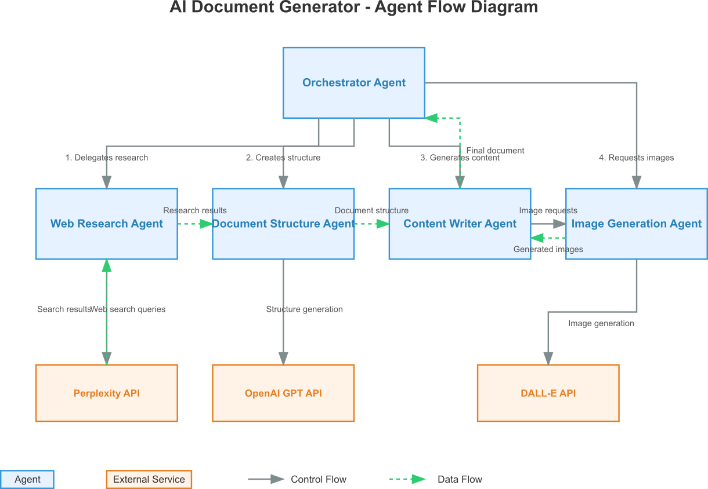

# AI Document Generator

An AI-powered system for generating research reports using FastAPI, LangChain, and Perplexity AI.

## Features

- Automated research on any topic using Perplexity AI
- Multiple report templates (standard, academic, business)
- Rich text formatting with tables and images
- Citation tracking and credibility scoring
- Asynchronous report generation
- Progress tracking and status updates
- Microsoft Word (DOCX) output

## Architecture

The AI Document Generator uses a multi-agent system architecture for generating comprehensive research reports. Each agent specializes in a specific task and communicates with the others through a well-defined flow.

### Agent Flow Structure



#### Main Agents:

1. **Orchestrator Agent**
   - Central coordinator that manages the entire document generation workflow
   - Initiates and sequences the actions of other specialized agents
   - Maintains task status and handles the overall process from start to completion

2. **Web Research Agent**
   - Conducts research on given topics using the Perplexity API
   - Processes queries and evaluates the credibility of sources
   - Formats research results into structured data for other agents to use

3. **Document Structure Agent**
   - Organizes research into a comprehensive, detailed document structure
   - Creates section hierarchies with multiple subsections
   - Uses the OpenAI API (specifically o3-mini model) for structure generation

4. **Content Writer Agent**
   - Generates detailed content for each section based on the document structure
   - Converts markdown to DOCX format for the final document
   - Requests images based on section content and integrates them into the document

5. **Image Generation Agent**
   - Specialized agent responsible for generating high-quality images
   - Handles different image styles (abstract, realistic, diagram, infographic, artistic)
   - Processes both single image requests and batch generation
   - Interfaces with the DALL-E API for image creation

#### External Services:

1. **Perplexity API**
   - Used by the Web Research Agent for up-to-date information
   - Provides source citations and evaluation of source credibility

2. **OpenAI GPT API**
   - Used by all agents with different models for specific needs
   - Base agent defaults to "gpt-4o-mini" with temperature 0.3
   - Document Structure Agent uses "o3-mini" for extensive structure generation

3. **DALL-E API**
   - Used by the Image Generation Agent for creating visual elements
   - Generates images based on detailed descriptions with customizable styles

#### Process Flow:

1. The Orchestrator Agent creates a research plan and delegates tasks
2. The Web Research Agent gathers and analyzes information
3. The Document Structure Agent organizes research into a coherent structure
4. The Content Writer Agent generates detailed content and requests images
5. The Image Generation Agent creates visual elements for the document
6. The final document flows back to the Orchestrator for delivery via the API

## Prerequisites

- Python 3.10 or higher
- Docker (optional)
- API Keys:
  - Perplexity AI API key
  - OpenAI API key

## Setup

### Local Development

1. Clone the repository:
   ```bash
   git clone https://github.com/yourusername/ai-doc-generator.git
   cd ai-doc-generator
   ```

2. Create a virtual environment:
   ```bash
   python -m venv venv
   source venv/bin/activate  # Linux/macOS
   # or
   venv\Scripts\activate  # Windows
   ```

3. Install dependencies:
   ```bash
   pip install -r requirements.txt
   ```

4. Create `.env.local` file:
   ```bash
   cp .env.example .env.local
   # Edit .env.local with your API keys
   ```

5. Run the application:
   ```bash
   python main.py
   ```

### Docker Development

1. Build and run with Docker Compose:
   ```bash
   docker-compose up --build
   ```

## Usage

The API will be available at http://localhost:8000

### API Endpoints

- `POST /generate-report`
  ```json
  {
    "topic": "Your research topic",
    "template_type": "standard",
    "max_pages": 10,
    "include_images": true
  }
  ```

- `GET /report-status/{task_id}`
  - Check the status of a report generation task

- `GET /download-report/{task_id}`
  - Download the generated report (DOCX format)

- `GET /health`
  - Health check endpoint

### Example

```python
import requests

# Start report generation
response = requests.post(
    "http://localhost:8000/generate-report",
    json={
        "topic": "Sustainable Finance in Indonesia",
        "template_type": "business",
        "max_pages": 15,
        "include_images": True
    }
)

task_id = response.json()["task_id"]

# Check status
status = requests.get(f"http://localhost:8000/report-status/{task_id}")

# Download report when completed
if status.json()["status"] == "completed":
    report = requests.get(f"http://localhost:8000/download-report/{task_id}")
```

## Testing

Run tests with pytest:
```bash
pytest
```

## Deployment

The application includes GitHub Actions workflows for CI/CD:

1. Automated testing on pull requests
2. Docker image building and pushing to Docker Hub
3. Deployment to your chosen cloud platform

## Contributing

1. Fork the repository
2. Create a feature branch
3. Commit your changes
4. Push to the branch
5. Create a pull request

## License

This project is licensed under the MIT License - see the LICENSE file for details. 